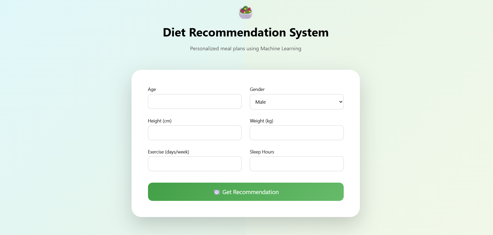
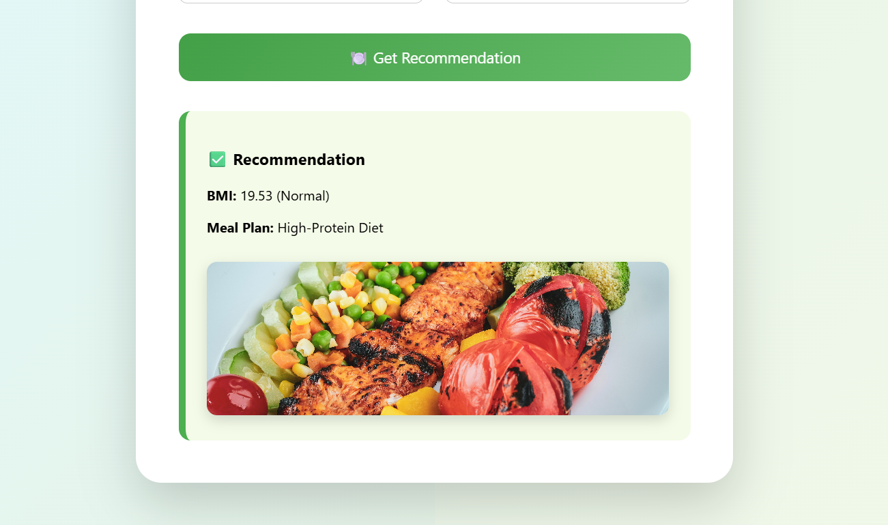

## 🥗 Diet Recommendation System
A smart, Machine Learning–powered diet recommendation application that helps users receive personalized meal plans based on their health details such as BMI, exercise frequency, and sleep habits.

### 🧩 Main Page
Users can enter basic health information through an interactive dashboard to receive diet recommendations.

### 🚀 Features
Enter personal health details (age, gender, height, weight)
Automatic BMI calculation with health category
Personalized diet plan recommendation using ML
Clean, responsive dashboard UI
Dynamic diet images based on prediction

### 📊 BMI & Health Analysis
Calculates BMI in real time
Classifies users into health categories (Underweight, Normal, Overweight, Obese)
Displays BMI clearly along with diet results

### 🍽️ Diet Recommendation Result
Uses a trained Machine Learning model to predict suitable diet plans
Supports multiple diet types (Balanced, Low-Fat, High-Protein, Vegan, Keto, Mediterranean)
Shows diet-related images for better understanding

### 🛠️ Tech Stack
Frontend: HTML, CSS, JavaScript
Backend: Python, Flask
Machine Learning: Scikit-learn, Pandas, NumPy

📦 Installation

# Clone the repository
git clone https://github.com/your-username/your-repo-name.git

# Navigate into the project folder
cd your-repo-name

# Install required dependencies
pip install -r requirements.txt

# Run the Flask application
cd app
python app.py

# Open the application in your browser
http://127.0.0.1:5000
